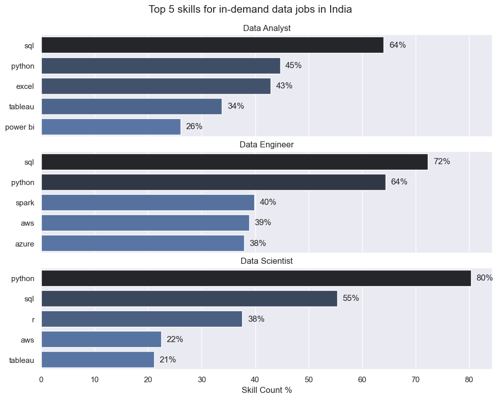
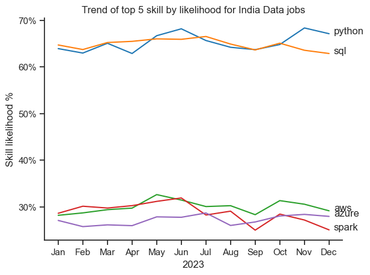
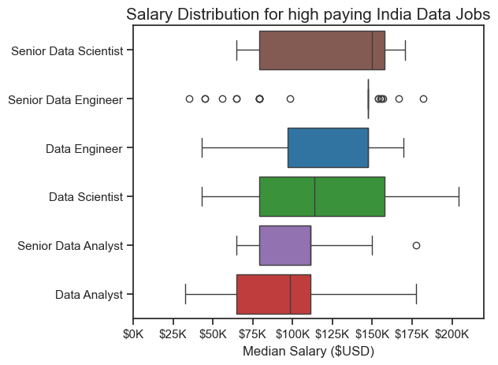
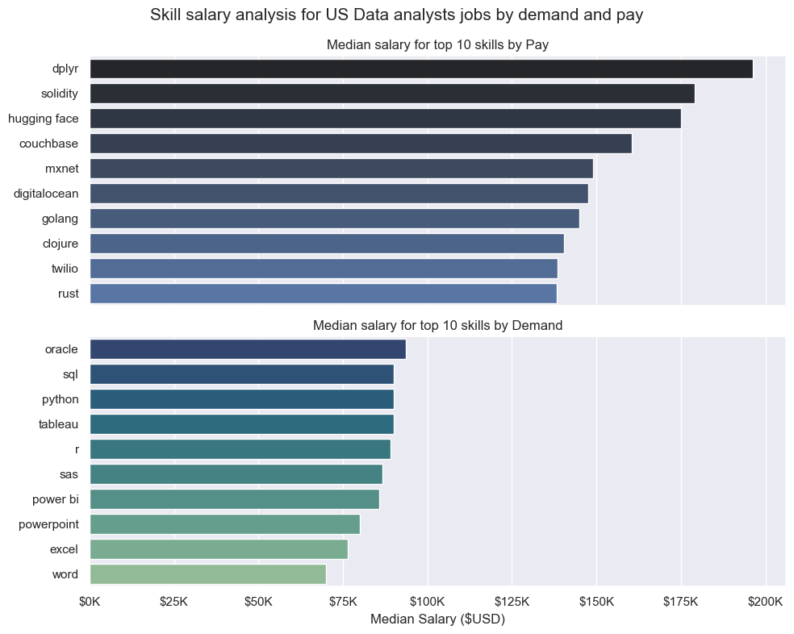
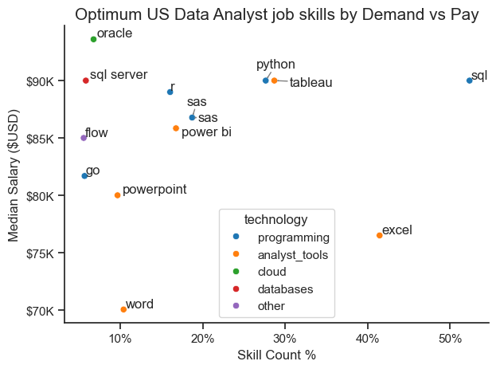

<a name="top"></a>
# 📊  Data Analyst Job Market Analysis: India vs. US

Analysis of Data analyst jobs in India and US using the core tools python and vs-code exploring the different trends and results from the data.

## ❓ The Questions 👀
Below are the core questions I aimed to answer through this data analysis project:

1. **What are the skills most in demand for the top 3 most popular data roles?** 🎯
2. **How are in-demand skills trending for Data Analysts?** 📈
3. **How well do jobs and skills pay for Data Analysts?** 💰
4. **What are the optimal skills for data analysts to learn? (High Demand AND High Paying)** 🚀

## 🚀 1. Introduction
With the help of Luke Barousse's Data Analyst Python course I was able to complete this project while analysing how the data science jobs and respective skills alter the demand and pay for the jobs itself.

### 🛠️ Tech Stack & Tools
* **Language:** Python 🐍
* **Environment:** Visual Studio Code (VS Code) 💻
* **Key Libraries:** `Pandas` for data wrangling, `Seaborn` & `Matplotlib` for high-impact visualizations.
* **Troubleshooting:** `Chatgpt/Gemini` for clearing any issues and problems faced while writing the codes.
* **Data Source & Setup:** The data for this analysis is dynamically pulled from the `Hugging Face datasets` library, ensuring the latest job postings are utilized for the India market.

    ```python
    # Importing libraries
    from datasets import load_dataset
    import pandas as pd

    # Loading data
    dataset = load_dataset("lukebarousse/data_jobs")
    df = dataset['train'].to_pandas()
    ```
---

## 📈 2. Analysis of Skill Demand
Using a dataset filtered specifically for **India**, I analyzed the top 5 skills for three core roles: **Data Analyst**, **Data Engineer**, and **Data Scientist**. 

### 🔍 Key Insights from the Analysis:
* **Python is Dominant:** It is the #1 skill for **Data Scientists (80%)** and the #2 skill for both Data Engineers (64%) and Data Analysts (45%). 🐍
* **The Power of SQL:** SQL remains a non-negotiable foundation, required by **72% of Data Engineers** and **64% of Data Analysts**. 🗄️
* **Cloud & Big Data:** For **Data Engineers**, specialized tools like **Spark (40%)**, **AWS (39%)**, and **Azure (38%)** are essential for modern data pipelines. ☁️
* **Visualization Preference:** **Tableau** appears as a top-5 requirement for both Data Analysts (34%) and Data Scientists (21%), proving that storytelling with data is a cross-functional necessity. 📊

### 🖼️ Featured Visualization

> *Figure 1: Percentage of job postings requiring specific technical skills in India.*

## 💻 Code Sneak Peek: Dynamic Data Labeling
One of the key features of this analysis is the automated labeling of bar charts to show percentages for better readability. Here is the logic used to inject those labels directly into the Seaborn subplots:

```python
# Iterating through the subplots to add percentage labels
for i, job_title in enumerate(job_titles):
    df_plot = df_ind_skill_perc[df_ind_skill_perc['job_title_short'] == job_title].head(5)
    
    # Adding data labels (v+1 adds a small offset for the text)
    for n, v in enumerate(df_plot['skill_count_perc']):
        ax[i].text(v + 1, n, f'{v:.0f}%', va='center')
```
#### View my notebook for detailed steps: [Skill_demand.py](3_Project/2_Skill_demand.ipynb) 📄
---

## 📈 3. Analysis of Skill Trends (2023)
Using a time-series pivot of the **India** dataset, I tracked how the demand for the top 5 technical skills evolved month-to-month throughout 2023.

### 🔍 Key Insights from the Trend Analysis:
* **The "Big Two" Stability:** **Python** and **SQL** maintain a massive lead, consistently appearing in **60-68%** of job postings throughout the year. 🏔️ 
* **Mid-Year Surge:** Most skills, particularly **Python**, saw a noticeable peak around **June (68%)**, suggesting a mid-year hiring push during Q2/Q3. 📈
* **Cloud Infrastructure Rivalry:** **AWS** and **Azure** track very closely together (averaging **~28-30%**), indicating that the market in India is split between the two major providers. ☁️
* **Spark’s Volatility:** **Spark** showed the most fluctuation, dipping to its lowest point in **September (25%)** before stabilizing, reflecting its specialized nature in big data engineering cycles. ⚡

### 🖼️ Featured Visualization

> *Figure 2: Monthly likelihood (%) of top skills appearing in India-based data job postings (2023).*

## 💻 Code Sneak Peek: Data Labeling and Format
To make the visualization more intuitive, I removed the standard legend and replaced it with direct labels at the end of each line. This allows readers to immediately identify the skill without looking back and forth at a color key. I also formatted the Y-axis to display as clean percentages.

```python
# Data labels for better visuals
for i in range(5):
    plt.text(
        11.2, 
        df_ind_skill_pivot.iloc[-1,i], df_ind_skill_pivot.columns[i], 
        va='center'
        )

# Formatting the y-axis as %
from matplotlib.ticker import PercentFormatter
ax= plt.gca()
ax.yaxis.set_major_formatter(
    PercentFormatter(decimals=0)
        )
```
#### View my notebook for detailed steps: [Skill_trend.py](3_Project/3_Skill_trend.ipynb) 📄
---


## 💰 4. Salary Analysis
In this section, I explored the financial landscape of data roles in India, focusing on the top 6 highest-paying job titles to understand the earning potential and salary spread across different levels of seniority.

### 🔍 Key Insights from Salary Analysis:
* **Senior Roles Command a Premium:** **Senior Data Scientists** and **Senior Data Engineers** have the highest median salaries, reflecting the high value placed on specialized experience. 💎
* **Wide Range for Data Scientists:** The salary for **Data Scientists** shows the largest variance, with top-tier roles reaching up to **$200K**, indicating a high ceiling for expertise. 🚀
* **Entry-Mid Level Consistency:** **Data Analysts** and **Data Engineers** show more compact salary ranges, providing a stable and predictable earning path for those entering the field. 📊
* **High-End Outliers:** Most roles feature significant outliers, suggesting that niche specializations or international firms in the Indian market often pay well above the standard median. 📈

### 🖼️ Featured Visualization

> *Figure 3: Yearly salary distribution ($USD) for the top 6 highest-paying data job titles in India.*

## 💻 Code Sneak Peek: Data Cleaning & Salary Visualization
To ensure accurate comparisons, I unified the salary data by converting hourly rates to annual figures and used a boxplot to visualize the distribution. I also applied a custom formatter to the X-axis for better readability.

```python
# Unifying salary data (Hourly to Yearly conversion)
def combine_salaries(row):
    if pd.notna(row['salary_year_avg']):
        return row['salary_year_avg']
    elif pd.notna(row['salary_hour_avg']):
        return row['salary_hour_avg'] * 52 * 40
    return None

# Custom X-axis formatting ($100,000 -> $100K)
ax = plt.gca()
ax.xaxis.set_major_formatter(lambda x, pos: f'${int(x/1000)}K')

# Generating the distribution plot
sns.boxplot(
    data=df_ind_salary,
    x='yearly_salary_combined', 
    y='job_title_short', 
    hue='job_title_short', 
    palette='tab10',     
    legend=False,          
    order=df_ind_jobs.index
)
```
#### View my notebook for detailed steps: [Salary_analysis.py](3_Project/4_Salary_analysis.ipynb) 📄
---
## ⚖️ 5. Skill Salary Analysis: Demand vs. Pay
In this final analysis, I examined the relationship between skill popularity (demand) and the financial reward (pay). This helps identify "hidden gem" skills that pay exceptionally well despite not being the most common requirements.

### 🔍 Key Insights:
* **High-Pay Niche Skills:** Specialized tools like **dplyr**, **solidity**, and **hugging face** command the highest median salaries, often exceeding **$150K**, due to their specialized nature in data science and blockchain. 💎
* **Stable Demand Skills:** Core foundational skills like **SQL**, **Python**, and **Oracle** show the highest demand. While their median salaries are lower (around **$90K**), they offer the most job security and volume. 🏗️
* **The "Sweet Spot":** Cloud-native and modern stack tools like **Go** and **Rust** appear in the high-pay category, suggesting that moving toward systems programming in data pays off. 🚀
* **Visualizing the Gap:** There is a clear distinction between what the market *needs most* (SQL/Excel) and what the market *pays most for* (Specialized libraries/languages).

### 🖼️ Featured Visualization

> *Figure 4: Comparison of Top 10 skills by Median Salary (Pay) vs. Top 10 skills by Frequency (Demand).*

## 💻 Code Sneak Peek: Multi-Plot Visualization
To create this side-by-side comparison, I utilized Matplotlib subplots and Seaborn bar charts, sharing the X-axis to ensure the salary scales were directly comparable.

```python
# Create a figure with two subplots sharing the same X-axis
fig, ax = plt.subplots(2, 1, figsize=(10, 8), sharex=True)

# Top Plot: Highest Paying Skills (Sorted by Median)
sns.barplot(data=skills_pay, x='median', y=skills_pay.index, ax=ax[0], palette='dark:b')
ax[0].set_title('Median salary for top 10 skills by Pay')

# Bottom Plot: Most In-Demand Skills (Sorted by Median for consistency)
sns.barplot(data=skills_demand, x='median', y=skills_demand.index, ax=ax[1], palette='crest_r')
ax[1].set_title('Median salary for top 10 skills by Demand')

# Formatting X-axis as currency ($K)
ax[1].xaxis.set_major_formatter(plt.FuncFormatter(lambda x, pos: f'${int(x/1000)}K'))
```
#### View my notebook for detailed steps: [Skill_analysis.py](3_Project/5_Skill_analysis.ipynb) 📄
---
## 🎯 6. The "Optimum" Data Analyst Skills
The final phase of my analysis involved mapping out the "Sweet Spot" for Data Analyst skills in the US. By plotting **Skill Frequency (Demand)** against **Median Salary (Pay)**, I identified which technologies offer the best return on investment for career growth.

### 🔍 Key Insights from the Scatter Plot:
* **The Essentials:** **SQL** and **Excel** dominate the demand axis (bottom right), appearing in **40-50%+** of job postings. While they don't have the highest salaries, they are non-negotiable foundations for the role. 🛠️
* **High-Value Programming:** **Python** and **Tableau** represent the ideal balance, showing high demand (**~30%**) while commanding a premium median salary of **$90K**. ⚖️
* **The "Power" Niche:** Database tools like **Oracle** and **SQL Server** sit in the top-left quadrant—lower demand but higher pay (**$90K+**), suggesting that specialized data management remains a lucrative niche. 💰
* **Emerging Tech:** Languages like **Go** are starting to appear in the high-pay, low-demand sector, highlighting a shift toward more technical, engineering-heavy data roles. 🚀

### 🖼️ Featured Visualization

> *Figure 5: Scatter plot of Skill Count % vs. Median Salary, categorized by technology type.*

## 💻 Code Sneak Peek: Advanced Visualization & Labeling
To make this plot professional and readable, I used `adjust_text` to automatically prevent label overlapping and utilized `PercentFormatter` and `FuncFormatter` for clean axis labels.

```python
# Create the scatter plot with categorical coloring
sns.scatterplot(
    data=df_plot, 
    x='skill_percent', 
    y='median_salary', 
    hue='technology', 
    palette='tab10'
)

# Automated label adjustment to prevent overlapping
from adjustText import adjust_text
texts = [plt.text(df_plot['skill_percent'].iloc[i], df_plot['median_salary'].iloc[i], txt) 
         for i, txt in enumerate(df_plot['skills'])]
adjust_text(texts, arrowprops=dict(arrowstyle='->', color='gray'))

# Professional Axis Formatting
ax = plt.gca()
ax.xaxis.set_major_formatter(PercentFormatter(decimals=0))
ax.yaxis.set_major_formatter(plt.FuncFormatter(lambda x, pos: f'${int(x/1000)}K'))
```
#### View my notebook for detailed steps: [Optimum_skills.py](3_Project/6_Optimum_skills.ipynb) 📄
---
## 🏁 7. Final Conclusion

This comprehensive analysis of the 2023 data job market reveals a clear roadmap for aspiring and seasoned data professionals. By synthesizing data on skill demand, salary distributions, and geographic trends, we can draw the following strategic conclusions:

### 💡 Key Takeaways:
* **The "Golden Trio":** **SQL**, **Python**, and **Tableau** remain the most "optimum" skills. They offer the highest job security (demand) while maintaining a competitive salary floor ($90K–$100K). 🥇
* **Specialization Pays:** While foundational skills get you in the door, niche expertise in **Machine Learning (Hugging Face)**, **Cloud Infrastructure (AWS/Azure)**, or **Systems Programming (Go/Rust)** is the primary driver for reaching the $150K+ salary bracket. 💎
* **The Seniority Leap:** In the Indian market specifically, transitioning from a "Data Analyst" to a "Senior" or "Engineer" role can more than double your median earning potential, highlighting a strong reward for technical persistence. 📈
* **Tool Convergence:** The modern Data Analyst is increasingly expected to mirror a Data Engineer, with a growing demand for database management (Oracle/SQL Server) and automated data pipelines. 🛠️


[Back to Top ^_^](#top)